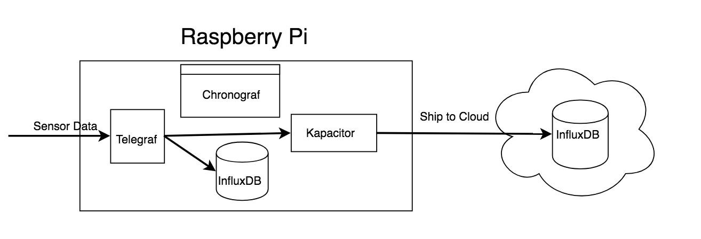

# resin-influx

A basic example of running the [InfluxData](https://influxdata.com/) TICK Stack via [resin.io](https://resin.io).

This Dockerfile spins up and configures the following processes:

- [Telegraf](https://github.com/influxdata/telegraf): Gathers data. It also acts as the ingest point for any sensor data
- [InfluxDB](https://github.com/influxdata/influxdb): Stores data locally
- [Kapacitor](https://github.com/influxdata/kapacitor): Provides a system for alerting and metrics shipping to the cloud
- [Chronograf](https://github.com/influxdata/chronograf): UI to administer the local stack and perform analysis. 

### Architecture



### How to enable cloud shipping

In order to enable shipping to the cloud you need to enable the InfluxDBOut named "cloudInflux" and then define and enable the `toCloud.tick` script.

First change the kapacitor configuration in the `./config/kapacitor.conf` to enable the `[[influxdb]]name="cloudInflux"` section. You will need to provide connection credentials to a running InfluxDB server that is available over the internet. Spinning up an [Uno instance on InfluxCloud](https://cloud.influxdata.com/cloud#cluster-form) is a great way to give this a try:

```toml
...
[[influxdb]]
  enabled = true 🌟
  default = false
  name = "cloudInflux"
  urls = ["https://{{cloud-instance}}.influxcloud.net:8086"] 🌟
  username = "myUser" 🌟 
  password = "myPass" 🌟
  timeout = 0
  insecure-skip-verify = false
  startup-timeout = "5m"
  disable-subscriptions = true
  subscription-protocol = "http"
  subscriptions-sync-interval = "1m0s"
  kapacitor-hostname = ""
  http-port = 0
  udp-bind = ""
  udp-buffer = 1000
  udp-read-buffer = 0
  [influxdb.subscriptions]
  [influxdb.excluded-subscriptions]
...
```

After changing the configuration, `git push resin master` to update the code on your device and wait for the changes to be pushed. Then use the resin.io web interface to open a terminal to your pi and run the following commands to enable the tickscript that will ship your metrics:

```
$ kapacitor define shipToCloud -dbrp telegraf.autogen -tick toCloud.tick -type stream
$ kapacitor enable shipToCloud
```
